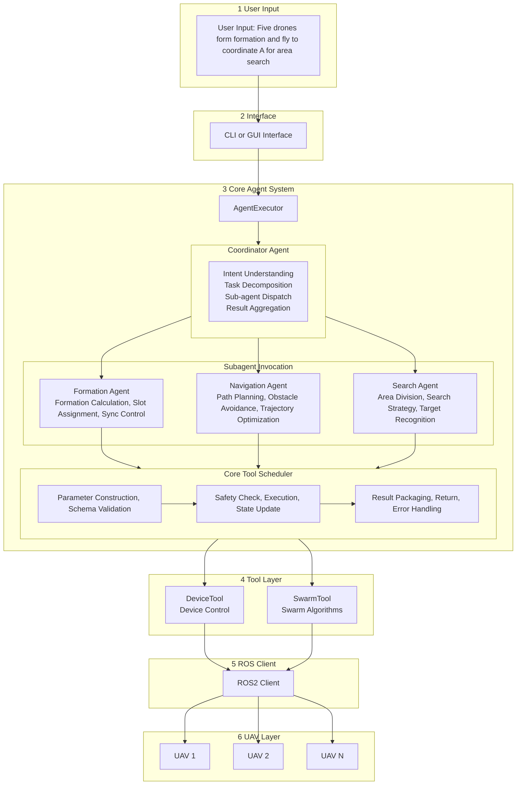

UAV Commander

> LLM-Powered Intelligent UAV Swarm Control Multi-Agent System

---

## Overview

**UAV Commander** is an intelligent control framework for UAV swarms, built on a **Multi-Agent Orchestration** architecture that deeply integrates Large Language Models (LLMs) with drone control systems. By implementing an Agent-as-Tool pattern, the system enables a coordinator agent to dynamically dispatch multiple specialist sub-agents, achieving end-to-end conversion from natural language commands to drone behaviors.

### Design Philosophy

This project draws inspiration from the Google Gemini CLI Agent framework design pattern. The core concept is:

> **"Encapsulate sub-agents as executable tools (Invocations), enabling safe, controlled, and streamable invocation by other agents"**

### Key Features

| Feature | Description |
|---------|-------------|
| **Multi-Agent Orchestration** | Coordinator agent dynamically dispatches multiple specialist sub-agents |
| **Agent-as-Tool** | Sub-agents are invoked as tools, unifying tool and agent execution models |
| **Streaming Activity Output** | Sub-agent thought processes (Thought Chunks) stream in real-time to UI |
| **Multi-Level Approval** | Dangerous operations require human confirmation; supports STRICT / NORMAL / YOLO modes |
| **Event-Driven Architecture** | EventBus-based state publishing and subscription mechanism |
| **ROS 2 Native Integration** | Communication with drones via Topics / Services / Actions |

---

## 🏗️ System Architecture



### Architecture Diagram

```
┌──────────────────────────────────────────────────────────────────────────────┐
│                              UAV Commander                                   │
├──────────────────────────────────────────────────────────────────────────────┤
│                                                                              │
│  ┌────────────────┐                                                          │
│  │   User Input   │  "5 drones fly in formation to coordinate A, then        │
│  └───────┬────────┘   execute area search"                                   │
│          │                                                                   │
│          ▼                                                                   │
│  ┌───────────────────────────────────────────────────────────────────────┐   │
│  │                        CLI / GUI Interface                            │   │
│  │                    (RequestContext, EventBus)                         │   │
│  └───────────────────────────────┬───────────────────────────────────────┘   │
│                                  │                                           │
│  ╔═══════════════════════════════╧═══════════════════════════════════════╗   │
│  ║                         CORE AGENT SYSTEM                             ║   │
│  ║  ┌─────────────────────────────────────────────────────────────────┐  ║   │
│  ║  │                      AgentExecutor                              │  ║   │
│  ║  │  ┌───────────────────────────────────────────────────────────┐  │  ║   │
│  ║  │  │                 Coordinator Agent                         │  │  ║   │
│  ║  │  │                                                           │  │  ║   │
│  ║  │  │  • Intent Understanding                                   │  │  ║   │
│  ║  │  │  • Task Decomposition                                     │  │  ║   │
│  ║  │  │  • Subagent Dispatch                                      │  │  ║   │
│  ║  │  │  • Result Aggregation                                     │  │  ║   │
│  ║  │  │                                                           │  │  ║   │
│  ║  │  │  LLM: OpenAI / Claude / Gemini / Local                    │  │  ║   │
│  ║  │  └───────────────────────────────────────────────────────────┘  │  ║   │
│  ║  │                              │                                  │  ║   │
│  ║  │              ┌───────────────┼───────────────┐                  │  ║   │
│  ║  │              │ tool_call:    │ tool_call:    │                  │  ║   │
│  ║  │              │ "formation"   │ "search"      │                  │  ║   │
│  ║  │              ▼               ▼               ▼                  │  ║   │
│  ║  │  ┌─────────────────────────────────────────────────────────┐    │  ║   │
│  ║  │  │              SubagentInvocation Layer                   │    │  ║   │
│  ║  │  │                                                         │    │  ║   │
│  ║  │  │  ┌───────────────┐  ┌───────────────┐  ┌─────────────┐  │    │  ║   │
│  ║  │  │  │ Formation     │  │ Navigation    │  │ Search      │  │    │  ║   │
│  ║  │  │  │ Agent         │  │ Agent         │  │ Agent       │  │    │  ║   │
│  ║  │  │  │               │  │               │  │             │  │    │  ║   │
│  ║  │  │  │ • Formation   │  │ • Path        │  │ • Area      │  │    │  ║   │
│  ║  │  │  │   Calculation │  │   Planning    │  │   Division  │  │    │  ║   │
│  ║  │  │  │ • Slot        │  │ • Obstacle    │  │ • Search    │  │    │  ║   │
│  ║  │  │  │   Assignment  │  │   Avoidance   │  │   Strategy  │  │    │  ║   │
│  ║  │  │  │ • Sync        │  │ • Trajectory  │  │ • Target    │  │    │  ║   │
│  ║  │  │  │   Control     │  │   Optimization│  │   Detection │  │    │  ║   │
│  ║  │  │  └───────┬───────┘  └───────┬───────┘  └──────┬──────┘  │    │  ║   │
│  ║  │  │          │                  │                 │         │    │  ║   │
│  ║  │  │          └──────────────────┼─────────────────┘         │    │  ║   │
│  ║  │  │                             │ tool_call                 │    │  ║   │
│  ║  │  └─────────────────────────────┼───────────────────────────┘    │  ║   │
│  ║  └────────────────────────────────┼────────────────────────────────┘  ║   │
│  ║                                   │                                   ║   │
│  ║  ┌────────────────────────────────┼────────────────────────────────┐  ║   │
│  ║  │                     CoreToolScheduler                           │  ║   │
│  ║  │                                                                 │  ║   │
│  ║  │  ┌─────────────┐  ┌─────────────┐  ┌─────────────┐              │  ║   │
│  ║  │  │ Tool        │  │ Tool        │  │ Tool        │              │  ║   │
│  ║  │  │ Invocation  │  │ Execution   │  │ Result      │              │  ║   │
│  ║  │  │             │  │             │  │             │              │  ║   │
│  ║  │  │ • Parameter │→ │ • Safety    │→ │ • Result    │              │  ║   │
│  ║  │  │   Building  │  │   Check     │  │   Packaging │              │  ║   │
│  ║  │  │ • Schema    │  │ • Execution │  │ • LLM       │              │  ║   │
│  ║  │  │   Validation│  │ • State     │  │   Return    │              │  ║   │
│  ║  │  │             │  │   Update    │  │ • Error     │              │  ║   │
│  ║  │  │             │  │             │  │   Handling  │              │  ║   │
│  ║  │  └─────────────┘  └─────────────┘  └─────────────┘              │  ║   │
│  ║  │                                                                 │  ║   │
│  ║  │  State Flow: Scheduled → Executing → Success / Error / Cancelled│  ║   │
│  ║  └─────────────────────────────────────────────────────────────────┘  ║   │
│  ╚═══════════════════════════════════════════════════════════════════════╝   │
│                                      │                                       │
│  ┌───────────────────────────────────┼───────────────────────────────────┐   │
│  │                          Tool Layer                                   │   │
│  │                                                                       │   │
│  │  ┌─────────────────┐  ┌─────────────────┐  ┌─────────────────────┐    │   │
│  │  │   DeviceTool    │  │   SwarmTool     │  │   SafetyGuardTool   │    │   │
│  │  │                 │  │                 │  │                     │    │   │
│  │  │  • arm/disarm   │  │  • formation    │  │  • geofence_check   │    │   │
│  │  │  • takeoff      │  │  • disperse     │  │  • collision_detect │    │   │
│  │  │  • land         │  │  • follow       │  │  • emergency_stop   │    │   │
│  │  │  • goto         │  │  • sync_action  │  │  • parameter_guard  │    │   │
│  │  │  • velocity     │  │  • assign_task  │  │  • approval_check   │    │   │
│  │  └────────┬────────┘  └────────┬────────┘  └──────────┬──────────┘    │   │
│  │           │                    │                      │               │   │
│  └───────────┼────────────────────┼──────────────────────┼───────────────┘   │
│              │                    │                      │                   │
│  ┌───────────┼────────────────────┼──────────────────────┼──────────────┐    │
│  │           │      ROS 2 Communication Bridge           │              │    │
│  │           │                                           │              │    │
│  │  ┌────────▼────────┐  ┌────────▼────────┐  ┌─────────▼─────────┐     │    │
│  │  │     Topics      │  │    Services     │  │     Actions       │     │    │
│  │  │                 │  │                 │  │                   │     │    │
│  │  │ /uav_{id}/pose  │  │ /uav_{id}/arm   │  │ /uav_{id}/goto    │     │    │
│  │  │ /uav_{id}/state │  │ /swarm/e_stop   │  │ /swarm/formation  │     │    │
│  │  │ /swarm/status   │  │ /uav_{id}/mode  │  │ /uav_{id}/path    │     │    │
│  │  └─────────────────┘  └─────────────────┘  └───────────────────┘     │    │
│  │                                                                      │    │
│  └──────────────────────────────────────────────────────────────────────┘    │
│                                      │                                       │
└──────────────────────────────────────┼───────────────────────────────────────┘
                                       │
                      ┌────────────────┼────────────────┐
                      ▼                ▼                ▼
                 ┌────────┐      ┌────────┐       ┌────────┐
                 │ UAV 1  │      │ UAV 2  │  ...  │ UAV N  │
                 │ (PX4)  │      │ (PX4)  │       │ (PX4)  │
                 └────────┘      └────────┘       └────────┘
```

---

## 📁 Project Structure

```
uavcommander/
├── core/                              # Core Modules
│   ├── agent/                         # Agent System ⭐
│   │   ├── executor.py                # AgentExecutor - Drives Agent main loop
│   │   │                              # • Manages LLM inference → tool call → result return cycle
│   │   │                              # • Handles streaming events (Content/ToolCall/Thought/Error)
│   │   │
│   │   ├── scheduler.py               # CoreToolScheduler - Tool scheduling hub ⭐
│   │   │                              # • Tool lifecycle: Scheduled → Executing → Success/Error
│   │   │                              # • Safety confirmation control (shouldConfirmExecute)
│   │   │                              # • Pre/post execution hooks (executeToolWithHooks)
│   │   │                              # • Batch tool call scheduling
│   │   │
│   │   ├── task.py                    # Task - State machine and event publishing
│   │   │                              # • Task states: submitted → working → input-required → completed/failed
│   │   │                              # • Tool call registration and resolution (pendingToolCalls)
│   │   │                              # • Event publishing to EventBus
│   │   │                              # • Tool confirmation handling (ToolConfirmationOutcome)
│   │   │
│   │   ├── invocation.py              # SubagentInvocation - Sub-agent execution container ⭐
│   │   │                              # • Wraps AgentDefinition as callable tool
│   │   │                              # • Initializes and runs AgentExecutor
│   │   │                              # • Streams sub-agent activity (onActivity → THOUGHT_CHUNK)
│   │   │                              # • Unified ToolResult packaging
│   │   │
│   │   ├── context.py                 # Context - Context management
│   │   │                              # • Conversation history maintenance
│   │   │                              # • Context compression (ChatCompressed)
│   │   │                              # • Multi-task context isolation
│   │   │
│   │   ├── registry.py                # AgentRegistry - Agent registry
│   │   │                              # • Agent definition registration and discovery
│   │   │                              # • Agent capability descriptions (Schema)
│   │   │
│   │   ├── basellm.py                 # BaseLLM - LLM abstract base class
│   │   │                              # • Defines LLM interface specification
│   │   │                              # • Streaming output support
│   │   │                              # • Failover mechanism
│   │   │
│   │   ├── llm.py                     # LLM implementations
│   │   │                              # • OpenAI / Claude / Gemini clients
│   │   │                              # • Function Calling / Tool Use
│   │   │                              # • Message history management
│   │   │
│   │   ├── prompts.py                 # Prompt template management
│   │   │                              # • System Prompt definitions
│   │   │                              # • Tool description generation
│   │   │                              # • Few-shot Examples
│   │   │
│   │   └── automator.py               # Automator - Autonomous execution logic
│   │                                  # • Multi-turn conversation auto-driving
│   │                                  # • Task completion determination
│   │
│   ├── tools/                         # Tool Layer
│   │   ├── tools.py                   # DeclarativeTool - Declarative tool base class
│   │   │                              # • tool.build(args) → ToolInvocation
│   │   │                              # • Three tool types: Normal/Modification/Editor
│   │   │                              # • Schema definition (JSON Schema)
│   │   │
│   │   ├── tool_registry.py           # ToolRegistry - Tool registry
│   │   │                              # • Tool discovery and registration
│   │   │                              # • Grouping by server (MCP Server)
│   │   │
│   │   ├── device_tool.py             # DeviceTool - Single device control
│   │   │                              # • arm/disarm, takeoff, land
│   │   │                              # • goto, set_velocity
│   │   │                              # • get_status, get_position
│   │   │
│   │   └── swarm_tool.py              # SwarmTool - Swarm control
│   │                                  # • form_formation, disperse
│   │                                  # • follow_leader, sync_action
│   │                                  # • assign_tasks
│   │
│   ├── config/                        # Configuration Management
│   │   ├── settings.py                # Global settings
│   │   ├── llm_config.py              # LLM configuration (model/API Key/parameters)
│   │   ├── safety_policy.py           # Safety policy configuration
│   │   └── ros_params.py              # ROS parameter configuration
│   │
│   └── schema/                        # Data Schema Definitions
│       ├── messages.py                # Message type definitions
│       ├── events.py                  # Event type definitions
│       ├── tool_call.py               # Tool call related types
│       └── task_state.py              # Task state definitions
│
├── cli/                               # Command Line Interface
│   ├── __init__.py
│   ├── main.py                        # CLI entry point
│   ├── repl.py                        # Interactive REPL
│   └── commands.py                    # Command definitions
│
├── utils/                             # Utility Functions
│   ├── __init__.py
│   ├── logging.py                     # Logging system
│   ├── event_bus.py                   # Event bus
│   └── async_utils.py                 # Async utilities
│
├── tests/                             # Tests
├── docs/                              # Documentation
├── requirements.txt                   # Dependencies
└── README.md
```

---

## 🔄 Multi-Agent Orchestration Flow

### Complete Orchestration Loop

```
┌─────────────────────────────────────────────────────────────────────────────┐
│                         Multi-Agent Orchestration Loop                      │
└─────────────────────────────────────────────────────────────────────────────┘

User Input: "Five drones form formation and fly to coordinate A"
         │
         ▼
╔═══════════════════════════════════════════════════════════════════════════╗
║  Phase 1: Coordinator Planning                                            ║
╠═══════════════════════════════════════════════════════════════════════════╣
║                                                                           ║
║    Coordinator Agent (LLM Reasoning):                                     ║
║    ┌──────────────────────────────────────────────────────────────────┐   ║
║    │  1. Understand intent: Formation flight task                     │   ║
║    │  2. Analyze requirements: Need formation control capability      │   ║
║    │  3. Decision: Invoke formation_agent subagent                    │   ║
║    │                                                                  │   ║
║    │  Output:                                                         │   ║
║    │  {                                                               │   ║
║    │    "tool_calls": [{                                              │   ║
║    │      "name": "formation_agent",                                  │   ║
║    │      "args": {                                                   │   ║
║    │        "formation_type": "V_SHAPE",                              │   ║
║    │        "target": {"lat": 31.2, "lon": 121.5, "alt": 50},         │   ║
║    │        "uav_ids": ["uav_1", "uav_2", "uav_3", "uav_4", "uav_5"]  │   ║
║    │      }                                                           │   ║
║    │    }]                                                            │   ║
║    │  }                                                               │   ║
║    └──────────────────────────────────────────────────────────────────┘   ║
║                                                                           ║
╚═══════════════════════════════════════════════════════════════════════════╝
         │
         │ Subagent invocation required
         ▼
╔═══════════════════════════════════════════════════════════════════════════╗
║  Phase 2: Create SubagentInvocation                                       ║
╠═══════════════════════════════════════════════════════════════════════════╣
║                                                                           ║
║    CoreToolScheduler:                                                     ║
║    ┌──────────────────────────────────────────────────────────────────┐   ║
║    │  # Find AgentDefinition by tool name                             │   ║
║    │  agent_def = agent_registry.get("formation_agent")               │   ║
║    │                                                                  │   ║
║    │  # Create SubagentInvocation instance                            │   ║
║    │  invocation = SubagentInvocation(                                │   ║
║    │      params=tool_call.args,                                      │   ║
║    │      definition=agent_def,                                       │   ║
║    │      config=config                                               │   ║
║    │  )                                                               │   ║
║    │                                                                  │   ║
║    │  # Register tool call                                            │   ║
║    │  task.register_tool_call(tool_call_id, "scheduled")              │   ║
║    └──────────────────────────────────────────────────────────────────┘   ║
║                                                                           ║
╚═══════════════════════════════════════════════════════════════════════════╝
         │
         ▼
╔═══════════════════════════════════════════════════════════════════════════╗
║  Phase 3: Execute Subagent                                                ║
╠═══════════════════════════════════════════════════════════════════════════╣
║                                                                           ║
║    invocation.execute():                                                  ║
║    ┌──────────────────────────────────────────────────────────────────┐   ║
║    │                                                                  │   ║
║    │  update_output("Subagent starting: formation_agent...")          │   ║
║    │                                                                  │   ║
║    │  # Create subagent executor                                      │   ║
║    │  executor = AgentExecutor.create(                                │   ║
║    │      agent_def=agent_def,                                        │   ║
║    │      config=config                                               │   ║
║    │  )                                                               │   ║
║    │                                                                  │   ║
║    │  # Bind activity callback - stream subagent thought process      │   ║
║    │  executor.on_activity = lambda event:                            │   ║
║    │      if event.type == THOUGHT_CHUNK:                             │   ║
║    │          update_output(f"{event.content}")                       │   ║
║    │                                                                  │   ║
║    │  # Run subagent                                                  │   ║
║    │  result = await executor.run()                                   │   ║
║    │                                                                  │   ║
║    │  # Subagent may continue calling tools internally                │   ║
║    │  # Formation Agent → SwarmTool.form_formation()                  │   ║
║    │  # Formation Agent → DeviceTool.goto() × 5                       │   ║
║    │                                                                  │   ║
║    └──────────────────────────────────────────────────────────────────┘   ║
║                                                                           ║
║    Real-time UI Display:                                                  ║
║    ┌──────────────────────────────────────────────────────────────────┐   ║
║    │  Subagent starting: formation_agent...                           │   ║
║    │  Analyzing formation requirements: 5 UAVs V-shape                │   ║
║    │  Calculating formation params: 60° angle, 10m spacing            │   ║
║    │  Assigning slots: UAV1→Lead, UAV2/3→Left, UAV4/5→Right           │   ║
║    │  Calling tool: swarm_tool.form_formation()                       │   ║
║    │  Formation command dispatched                                    │   ║
║    └──────────────────────────────────────────────────────────────────┘   ║
║                                                                           ║
╚═══════════════════════════════════════════════════════════════════════════╝
         │
         ▼
╔═══════════════════════════════════════════════════════════════════════════╗
║  Phase 4: Subagent Returns Result                                         ║
╠═══════════════════════════════════════════════════════════════════════════╣
║                                                                           ║
║    SubagentInvocation wraps ToolResult:                                   ║
║    ┌──────────────────────────────────────────────────────────────────┐   ║
║    │  {                                                               │   ║
║    │    "llm_content": [                                              │   ║
║    │      {                                                           │   ║
║    │        "type": "text",                                           │   ║
║    │        "text": "Subagent finished. V-formation established,      │   ║
║    │                 5 UAVs flying to target. ETA: 3 minutes."        │   ║
║    │      }                                                           │   ║
║    │    ],                                                            │   ║
║    │    "return_display": "Formation flight task initiated",          │   ║
║    │    "metadata": {                                                 │   ║
║    │      "formation_status": "FORMED",                               │   ║
║    │      "eta_seconds": 180,                                         │   ║
║    │      "uav_assignments": {...}                                    │   ║
║    │    }                                                             │   ║
║    │  }                                                               │   ║
║    └──────────────────────────────────────────────────────────────────┘   ║
║                                                                           ║
║    Scheduler updates tool status: "executing" → "success"                 ║
║    Task resolves tool call: task.resolve_tool_call(tool_call_id)          ║
║                                                                           ║
╚═══════════════════════════════════════════════════════════════════════════╝
         │
         ▼
╔═══════════════════════════════════════════════════════════════════════════╗
║  Phase 5: Coordinator Continues Reasoning                                 ║
╠═══════════════════════════════════════════════════════════════════════════╣
║                                                                           ║
║    Coordinator Agent after receiving subagent result:                     ║
║    ┌──────────────────────────────────────────────────────────────────┐   ║
║    │  # Tool result as new context input to LLM                       │   ║
║    │  llm_input = [                                                   │   ║
║    │      *previous_context,                                          │   ║
║    │      {"role": "tool", "content": tool_result.llm_content}        │   ║
║    │  ]                                                               │   ║
║    │                                                                  │   ║
║    │  # LLM continues reasoning                                       │   ║
║    │  response = await llm.generate(llm_input)                        │   ║
║    │                                                                  │   ║
║    │  # Determine: Need more tool calls? Or task complete?            │   ║
║    │  if response.has_tool_calls:                                     │   ║
║    │      # Return to Phase 2                                         │   ║
║    │  else:                                                           │   ║
║    │      # Return final result to user                               │   ║
║    │      return response.content                                     │   ║
║    └──────────────────────────────────────────────────────────────────┘   ║
║                                                                           ║
║    Final Output:                                                          ║
║    ┌──────────────────────────────────────────────────────────────────┐   ║
║    │  Formation flight task initiated!                                │   ║
║    │                                                                  │   ║
║    │  5 UAVs established V-formation, flying to target point A.       │   ║
║    │  • Formation type: V-shape (60° angle, 10m spacing)              │   ║
║    │  • Lead aircraft: UAV-1                                          │   ║
║    │  • Estimated arrival: 3 minutes                                  │   ║
║    │                                                                  │   ║
║    │  You can say "check formation status" or "emergency stop".       │   ║
║    └──────────────────────────────────────────────────────────────────┘   ║
║                                                                           ║
╚═══════════════════════════════════════════════════════════════════════════╝
```

---

## 🛡️ 安全设计

### Approval Modes

Based on the design in task.py, the system supports three approval modes:

```python
from enum import Enum

class ApprovalMode(Enum):
    STRICT = "strict"       # All operations require manual confirmation
    NORMAL = "normal"       # Only dangerous operations require confirmation (default)
    YOLO = "yolo"           # Auto-approve all operations (simulation only)
```

### Tool Confirmation Flow

```
┌──────────────────────────────────────────────────────────────────────────┐
│                       Tool Confirmation Flow                             │
└──────────────────────────────────────────────────────────────────────────┘

         LLM requests tool call: device_tool.takeoff(altitude=50)
                              │
                              ▼
         ┌────────────────────────────────────────┐
         │  Scheduler: shouldConfirmExecute()?    │
         │                                        │
         │  Check:                                │
         │  • Tool type (Modification/Normal)     │
         │  • Current ApprovalMode                │
         │  • Operation risk level                │
         └───────────────┬────────────────────────┘
                         │
          ┌──────────────┼──────────────┐
          ▼              ▼              ▼
    ┌──────────┐   ┌──────────┐   ┌──────────┐
    │ No       │   │ Requires │   │ Auto     │
    │ Confirm  │   │ Confirm  │   │ Approve  │
    │ (Normal  │   │ (STRICT  │   │ (YOLO    │
    │  tool)   │   │  or      │   │  mode)   │
    │          │   │  danger) │   │          │
    └────┬─────┘   └────┬─────┘   └────┬─────┘
         │              │              │
         │              ▼              │
         │   ┌────────────────────┐    │
         │   │  Publish status:   │    │
         │   │  awaiting_approval │    │
         │   │                    │    │
         │   │  UI shows dialog   │    │
         │   └─────────┬──────────┘    │
         │             │               │
         │             ▼               │
         │   ┌────────────────────┐    │
         │   │   User choice:     │    │
         │   │                    │    │
         │   │   • proceed_once   │    │
         │   │   • proceed_always │    │
         │   │   • cancel         │    │
         │   │   • modify         │    │
         │   └─────────┬──────────┘    │
         │             │               │
         └─────────────┼───────────────┘
                       ▼
              ┌────────────────┐
              │  Execute tool  │
              │  or cancel     │
              └────────────────┘
```

### Multi-Layer Safety Mechanisms

| Layer | Name | Trigger | Behavior |
|-------|------|---------|----------|
| L1 | **ApprovalGuard** | Before tool call | Prompt confirmation for dangerous operations |
| L2 | **ParameterGuard** | Parameter validation | Boundary checks, reject invalid parameters |
| L3 | **GeofenceGuard** | After position calculation | No-fly zone detection, automatic avoidance |
| L4 | **CollisionGuard** | During trajectory planning | Collision prediction, path replanning |
| L5 | **EmergencyStop** | Any time | Global/individual emergency stop |

### Dangerous Operation Classification

```python
DANGEROUS_OPERATIONS = {
    # High risk - Must confirm
    "HIGH": [
        "device_tool.arm",
        "device_tool.takeoff",
        "swarm_tool.form_formation",
        "swarm_tool.disperse",
    ],
    
    # Medium risk - Requires confirmation in NORMAL mode
    "MEDIUM": [
        "device_tool.goto",
        "device_tool.set_velocity",
        "swarm_tool.sync_action",
    ],
    
    # Low risk - Only confirm in STRICT mode
    "LOW": [
        "device_tool.get_status",
        "device_tool.land",  # Landing is relatively safe
    ]
}
```

---

## 📊 Task State Machine

Based on the task.py reference implementation, task state transitions are defined as follows:

```
                         ┌─────────────────────────────────────────┐
                         │              Task States                │
                         └─────────────────────────────────────────┘

                              ┌──────────────┐
              Task created ──→│   SUBMITTED  │
                              └──────┬───────┘
                                     │
                                     │ start()
                                     ▼
                              ┌──────────────┐
          ┌──────────────────→│   WORKING    │←────────────────────┐
          │                   └──────┬───────┘                     │
          │                          │                             │
          │         ┌────────────────┼────────────────┐            │
          │         │                │                │            │
          │         ▼                ▼                ▼            │
          │  ┌─────────────┐  ┌─────────────┐  ┌─────────────┐     │
          │  │ LLM         │  │ Tool        │  │ Waiting for │     │
          │  │ Reasoning   │  │ Executing   │  │ Tool        │     │
          │  │ (streaming) │  │ (executing) │  │ (pending)   │     │
          │  └──────┬──────┘  └──────┬──────┘  └──────┬──────┘     │
          │         │                │                │            │
          │         └────────────────┼────────────────┘            │
          │                          │                             │
          │         ┌────────────────┼────────────────┐            │
          │         ▼                ▼                ▼            │
          │  ┌─────────────┐  ┌─────────────────┐  ┌───────────┐   │
          │  │ Need more   │  │ INPUT_REQUIRED  │  │ Tool call │   │
          │  │ tool calls  │  │ (await confirm) │  │ success   │   │
          │  └──────┬──────┘  └────────┬────────┘  └─────┬─────┘   │
          │         │                  │                 │         │
          └─────────┘                  │                 └─────────┘
                                       │
                          User confirmation / User input
                                       │
                    ┌──────────────────┼──────────────────┐
                    ▼                  ▼                  ▼
             ┌─────────────┐   ┌─────────────┐    ┌─────────────┐
             │  COMPLETED  │   │   FAILED    │    │  CANCELLED  │
             │             │   │             │    │             │
             │  Success    │   │  Failed     │    │  Cancelled  │
             └─────────────┘   └─────────────┘    └─────────────┘
```

### Event Types (Reference: CoderAgentEvent)

```python
class AgentEvent(Enum):
    # State changes
    STATE_CHANGE = "state_change"
    
    # Content output
    TEXT_CONTENT = "text_content"
    THOUGHT = "thought"
    
    # Tool related
    TOOL_CALL_UPDATE = "tool_call_update"
    TOOL_CALL_CONFIRMATION = "tool_call_confirmation"
    
    # Other
    CITATION = "citation"
    ERROR = "error"
```

---

## 🔧 Core Component Design

### 1. AgentExecutor

```python
class AgentExecutor:
    """Agent Executor - Drives the agent main loop"""
    
    def __init__(self, agent_def: AgentDefinition, config: Config):
        self.agent_def = agent_def
        self.config = config
        self.llm_client = config.get_llm_client()
        self.tool_registry = config.get_tool_registry()
        self.event_callbacks: List[Callable] = []
    
    async def run(self, input_message: str) -> AgentResult:
        """
        Main loop:
        1. Send message to LLM
        2. Process LLM response (content/tool calls/thoughts)
        3. If tool calls exist, execute and feed results back to LLM
        4. Repeat until task completion
        """
        pass
    
    def on_activity(self, callback: Callable[[AgentActivity], None]):
        """Register activity callback for streaming output"""
        self.event_callbacks.append(callback)
```

### 2. CoreToolScheduler

```python
class CoreToolScheduler:
    """Tool Scheduler - Manages complete tool call lifecycle"""
    
    def __init__(
        self,
        config: Config,
        output_update_handler: Callable,
        on_tool_calls_update: Callable,
        on_all_tool_calls_complete: Callable,
    ):
        self.config = config
        self.pending_calls: Dict[str, ToolCall] = {}
        # callbacks
        self.output_update_handler = output_update_handler
        self.on_tool_calls_update = on_tool_calls_update
        self.on_all_tool_calls_complete = on_all_tool_calls_complete
    
    async def schedule(
        self,
        requests: List[ToolCallRequest],
        abort_signal: asyncio.Event
    ) -> None:
        """
        Schedule a batch of tool calls:
        1. Build ToolInvocation
        2. Check if confirmation required
        3. Execute tool
        4. Collect results
        """
        pass
    
    def should_confirm_execute(self, tool: DeclarativeTool, args: dict) -> bool:
        """Determine if manual confirmation is required"""
        pass
```

### 3. SubagentInvocation

```python
class SubagentInvocation(BaseToolInvocation):
    """
    Subagent Execution Container
    
    Core responsibilities:
    - Wrap AgentDefinition as callable tool
    - Initialize and run AgentExecutor
    - Stream subagent activities
    - Uniformly wrap and return ToolResult
    """
    
    def __init__(
        self,
        params: dict,
        definition: AgentDefinition,
        config: Config
    ):
        self.params = params
        self.definition = definition
        self.config = config
    
    async def execute(
        self,
        update_output: Callable[[str], None]
    ) -> ToolResult:
        """
        Execute subagent:
        1. Output "Subagent starting..."
        2. Create AgentExecutor
        3. Bind onActivity callback
        4. Run subagent
        5. Wrap and return ToolResult
        """
        update_output(f"Subagent starting: {self.definition.name}...")
        
        executor = AgentExecutor(self.definition, self.config)
        
        # Stream thought process
        executor.on_activity(lambda event: 
            update_output(f"{event.content}") 
            if event.type == "THOUGHT_CHUNK" else None
        )
        
        result = await executor.run(self.params)
        
        return ToolResult(
            llm_content=[{"type": "text", "text": f"Subagent finished. {result.summary}"}],
            return_display=result.display,
            metadata=result.metadata
        )
```

### 4. Task

```python
class Task:
    """Task Management - State machine and event publishing"""
    
    def __init__(
        self,
        task_id: str,
        context_id: str,
        config: Config,
        event_bus: EventBus
    ):
        self.id = task_id
        self.context_id = context_id
        self.config = config
        self.event_bus = event_bus
        
        self.state: TaskState = TaskState.SUBMITTED
        self.scheduler = CoreToolScheduler(...)
        self.pending_tool_calls: Dict[str, str] = {}  # callId -> status
        self.pending_confirmations: Dict[str, ToolConfirmationDetails] = {}
    
    def set_state_and_publish(
        self,
        new_state: TaskState,
        message: Optional[str] = None,
        final: bool = False
    ):
        """Update state and publish event"""
        self.state = new_state
        self.event_bus.publish(TaskStatusUpdateEvent(
            task_id=self.id,
            state=new_state,
            message=message,
            final=final
        ))
    
    async def schedule_tool_calls(
        self,
        requests: List[ToolCallRequest],
        abort_signal: asyncio.Event
    ):
        """Schedule tool calls"""
        self.set_state_and_publish(TaskState.WORKING)
        await self.scheduler.schedule(requests, abort_signal)
    
    async def wait_for_pending_tools(self):
        """Wait for all pending tools to complete"""
        pass
    
    def handle_tool_confirmation(self, call_id: str, outcome: ToolConfirmationOutcome):
        """Handle user confirmation of tool calls"""
        pass
```

---

## 🔌 ROS 2 Integration

### Communication Interface Design

```python
class ROSBridge:
    """ROS 2 Communication Bridge Layer"""
    
    def __init__(self, node_name: str = "uav_commander"):
        self.node = rclpy.create_node(node_name)
        self._service_clients: Dict[str, Client] = {}
        self._action_clients: Dict[str, ActionClient] = {}
        self._subscribers: Dict[str, Subscription] = {}
        self._state_cache: Dict[str, Any] = {}
    
    # === Topics (State Subscription) ===
    
    def subscribe_uav_state(self, uav_id: str, callback: Callable):
        """Subscribe to UAV state"""
        topic = f"/uav_{uav_id}/state"
        self._subscribers[topic] = self.node.create_subscription(
            UAVState, topic, callback, 10
        )
    
    def get_cached_state(self, uav_id: str) -> Optional[UAVState]:
        """Get cached state"""
        return self._state_cache.get(f"uav_{uav_id}")
    
    # === Services (Immediate Commands) ===
    
    async def call_arm(self, uav_id: str, arm: bool) -> ServiceResponse:
        """Arm/Disarm"""
        srv_name = f"/uav_{uav_id}/arm"
        return await self._call_service(srv_name, ArmRequest(arm=arm))
    
    async def call_emergency_stop(self, uav_ids: Optional[List[str]] = None):
        """Emergency stop"""
        srv_name = "/swarm/emergency_stop"
        return await self._call_service(srv_name, EmergencyStopRequest(uav_ids=uav_ids))
    
    # === Actions (Long-running Tasks) ===
    
    async def send_goto(
        self,
        uav_id: str,
        target: Position,
        progress_callback: Optional[Callable] = None
    ) -> ActionResult:
        """Send waypoint flight Action"""
        action_name = f"/uav_{uav_id}/goto"
        goal = GotoGoal(target=target)
        
        return await self._send_action_goal(
            action_name, goal,
            feedback_callback=progress_callback
        )
    
    async def send_formation(
        self,
        formation_type: str,
        uav_ids: List[str],
        target: Position,
        progress_callback: Optional[Callable] = None
    ) -> ActionResult:
        """Send formation Action"""
        action_name = "/swarm/formation"
        goal = FormationGoal(
            formation_type=formation_type,
            uav_ids=uav_ids,
            target=target
        )
        return await self._send_action_goal(action_name, goal, progress_callback)
```

### Tool and ROS Integration Example

```python
class DeviceTool(DeclarativeTool):
    """Single Device Control Tool"""
    
    name = "device_tool"
    description = "Control basic operations of a single UAV"
    
    schema = {
        "takeoff": {
            "description": "Takeoff to specified altitude",
            "parameters": {
                "uav_id": {"type": "string", "description": "UAV ID"},
                "altitude": {"type": "number", "description": "Target altitude (meters)", "minimum": 1, "maximum": 120}
            },
            "required": ["uav_id", "altitude"],
            "dangerous": True  # Mark as dangerous operation
        },
        # ... other methods
    }
    
    def __init__(self, ros_bridge: ROSBridge):
        self.ros = ros_bridge
    
    async def takeoff(self, uav_id: str, altitude: float) -> ToolResult:
        """Execute takeoff"""
        # 1. Check current state
        state = self.ros.get_cached_state(uav_id)
        if state and state.armed and state.altitude > 0:
            return ToolResult.error(f"UAV {uav_id} is already airborne")
        
        # 2. Arm
        arm_result = await self.ros.call_arm(uav_id, arm=True)
        if not arm_result.success:
            return ToolResult.error(f"Arm failed: {arm_result.message}")
        
        # 3. Takeoff
        takeoff_result = await self.ros.send_takeoff(uav_id, altitude)
        
        return ToolResult(
            llm_content=[{"type": "text", "text": f"UAV {uav_id} taking off to {altitude}m"}],
            return_display=f"{uav_id} taking off...",
            metadata={"altitude_target": altitude}
        )
```

---

## 💡 Prompt Design Guide

### System Prompt Structure

```python
COORDINATOR_SYSTEM_PROMPT = """
You are the main coordinator agent for UAV Commander, responsible for understanding user UAV control intentions and orchestrating execution.

## Role Definition
You are a professional UAV swarm control expert capable of:
- Understanding flight task instructions in natural language
- Decomposing complex tasks into executable subtasks
- Dispatching appropriate specialist subagents to complete tasks
- Monitoring task execution status and reporting to users

## Available Tools

### Subagent Tools
1. `formation_agent` - Formation control specialist
   - Use for: Establishing/changing formations, formation flight
   - Parameters: formation_type, target, uav_ids

2. `navigation_agent` - Navigation planning specialist
   - Use for: Path planning, waypoint flight, obstacle avoidance
   - Parameters: waypoints, constraints

3. `search_agent` - Search task specialist
   - Use for: Area search, target identification
   - Parameters: search_area, pattern, target_type

### Direct Control Tools
1. `device_tool` - Single device control
   - takeoff, land, goto, arm, disarm, get_status

2. `swarm_tool` - Swarm control
   - form_formation, disperse, sync_action

3. `safety_tool` - Safety control
   - emergency_stop, check_geofence, get_battery_status

## Safety Guidelines
1. Must confirm all UAV status is normal before takeoff
2. Dangerous operations will request user confirmation, explain in output
3. Use emergency_stop immediately when encountering anomalies
4. Always monitor battery level, remind return when below 20%

## Output Specifications
- Briefly explain plan before executing operations
- Report execution status after calling tools
- Summarize results after task completion
- Clearly explain reasons and suggestions when encountering problems

## Example Dialogue

User: Have 3 drones take off and fly to the center of the playground
Assistant: Understood. I will execute the following steps:
1. Check status of 3 UAVs
2. Take off sequentially to safe altitude
3. Fly in formation to playground center

First checking UAV status...
[Call device_tool.get_status for uav_1, uav_2, uav_3]
"""
```

---

## 🚀 Development Roadmap

### Phase 1: Core Framework (MVP) - 4 Weeks

- [ ] **Core Agent System**
  - [ ] AgentExecutor main loop implementation
  - [ ] CoreToolScheduler tool scheduling
  - [ ] Task state machine and event publishing
  - [ ] SubagentInvocation subagent container

- [ ] **LLM Integration**
  - [ ] BaseLLM abstract interface
  - [ ] OpenAI / Claude client implementation
  - [ ] Streaming output support
  - [ ] Function Calling handling

- [ ] **Basic Tools**
  - [ ] DeviceTool (takeoff, land, goto)
  - [ ] ToolRegistry tool registration

- [ ] **CLI Interface**
  - [ ] Interactive REPL
  - [ ] Tool confirmation dialog

### Phase 2: ROS Integration & Swarm Capabilities - 4 Weeks

- [ ] **ROS 2 Bridge**
  - [ ] Topics subscription (state synchronization)
  - [ ] Services calls (immediate commands)
  - [ ] Actions client (long-running tasks)

- [ ] **Swarm Control**
  - [ ] SwarmTool implementation
  - [ ] Formation algorithm integration
  - [ ] Multi-UAV coordination logic

- [ ] **Multi-Agent**
  - [ ] AgentRegistry implementation
  - [ ] Formation Agent
  - [ ] Navigation Agent

### Phase 3: Safety & Reliability - 3 Weeks

- [ ] **Safety Mechanisms**
  - [ ] ApprovalMode three-level approval
  - [ ] ParameterGuard parameter validation
  - [ ] GeofenceGuard geofencing
  - [ ] EmergencyStop emergency interruption

- [ ] **Reliability**
  - [ ] LLM failover
  - [ ] ROS disconnection reconnection
  - [ ] Task state persistence

- [ ] **Logging & Auditing**
  - [ ] Structured logging
  - [ ] Operation audit tracking
  - [ ] Task replay

### Phase 4: Advanced Features - 4 Weeks

- [ ] **Intelligent Planning**
  - [ ] Search Agent
  - [ ] Adaptive task allocation
  - [ ] Automatic anomaly recovery

- [ ] **Extended Capabilities**
  - [ ] Multimodal input (voice)
  - [ ] Map visualization GUI
  - [ ] MCP server support

---

## 📚 Technical References

| Technology | Purpose | Reference |
|------------|---------|-----------|
| **Google Gemini CLI** | Agent framework design reference | [gemini-cli](https://github.com/anthropics/anthropic-tools) |
| **A2A Protocol** | Agent-to-Agent communication | [a2a-js/sdk](https://github.com/anthropics/a2a-js) |
| **PX4 Autopilot** | UAV flight controller | [px4.io](https://px4.io/) |
| **ROS 2** | Robot communication middleware | [docs.ros.org](https://docs.ros.org/) |
| **MAVSDK** | MAVLink SDK | [mavsdk.mavlink.io](https://mavsdk.mavlink.io/) |

---

## 📄 License

[To Be Determined]

---

## 🤝 Contributing

[To Be Determined]

---

> ⚠️ **Safety Disclaimer**  
> This system involves actual UAV control and may cause personal injury and property damage. Please use in compliance with laws and regulations, ensuring:
> - Necessary flight qualifications and permits
> - Operation in safe airspace and environments
> - Thorough testing in simulation environments before first use
> - Continuous human supervision and emergency interruption capability
