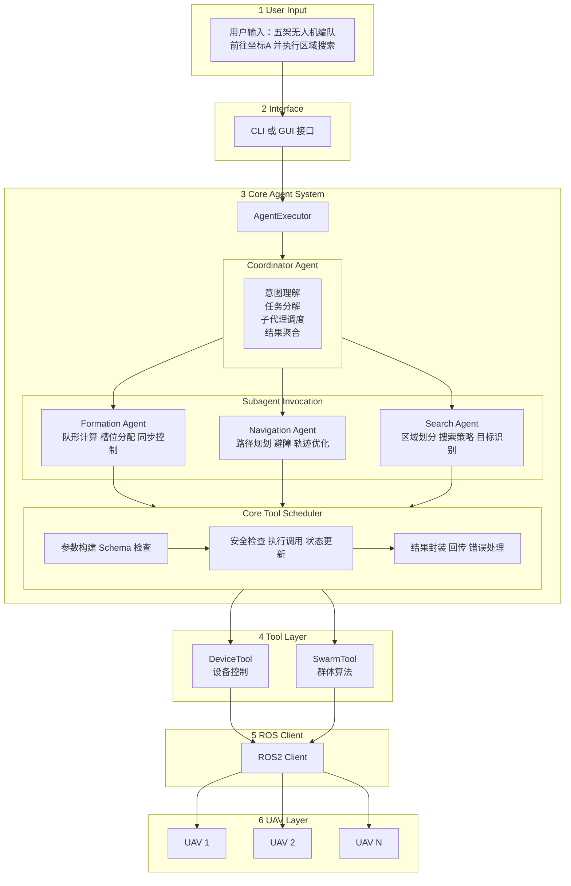

# UAV Commander

> 基于 LLM 的智能无人机集群控制 Multi-Agent 系统

---

## 项目概述

**UAV Commander** 是一个面向无人机集群（UAV Swarm）的智能控制框架，采用 **Multi-Agent Orchestration** 架构，将大语言模型（LLM）与无人机控制系统深度融合。系统通过将 Agent 工具化（Agent-as-Tool），实现主代理对多个专业子代理的动态调度，完成从自然语言指令到无人机行为的端到端转换。

### 设计理念

本项目借鉴了 Google Gemini CLI 的 Agent 框架设计模式，核心思想是：

> **"将子代理封装为可执行工具（Invocation），使其能被其他代理安全、可控、可流式地调用"**

### 核心特性

| 特性 | 描述 |
|------|------|
| **Multi-Agent 编排** | Coordinator 主代理动态调度多个 Specialist 子代理 |
| **Agent-as-Tool** | 子代理作为工具被调用，统一工具与代理的执行模型 |
| **流式活动输出** | 子代理思考过程（Thought Chunks）实时流式传递至 UI |
| **多级审批机制** | 危险操作需人工确认，支持 STRICT / NORMAL / YOLO 模式 |
| **事件驱动架构** | 基于 EventBus 的状态发布与订阅机制 |
| **ROS 2 原生集成** | 通过 Topics / Services / Actions 与无人机通信 |

---

## 🏗️ 系统架构

### 整体架构图

```
┌──────────────────────────────────────────────────────────────────────────────┐
│                              UAV Commander                                   │
├──────────────────────────────────────────────────────────────────────────────┤
│                                                                              │
│  ┌────────────────┐                                                          │
│  │   User Input   │  "5架无人机编队飞往坐标A，到达后展开区域搜索"                │
│  └───────┬────────┘                                                          │
│          │                                                                   │
│          ▼                                                                   │
│  ┌───────────────────────────────────────────────────────────────────────┐   │
│  │                        CLI / GUI Interface                            │   │
│  │                    (RequestContext, EventBus)                         │   │
│  └───────────────────────────────────┬───────────────────────────────────┘   │
│                                      │                                       │
│  ╔═══════════════════════════════════╧═══════════════════════════════════╗   │
│  ║                         CORE AGENT SYSTEM                             ║   │
│  ║  ┌─────────────────────────────────────────────────────────────────┐  ║   │
│  ║  │                      AgentExecutor                              │  ║   │
│  ║  │  ┌───────────────────────────────────────────────────────────┐  │  ║   │
│  ║  │  │                 Coordinator Agent                         │  │  ║   │
│  ║  │  │                                                           │  │  ║   │
│  ║  │  │  • 理解用户意图 (Intent Understanding)                       │  │  ║   │
│  ║  │  │  • 任务分解 (Task Decomposition)                            │  │  ║   │
│  ║  │  │  • 子代理调度 (Subagent Dispatch）                           │  │  ║   │
│  ║  │  │  • 结果聚合 (Result Aggregation)                            │  │  ║   │
│  ║  │  │                                                           │  │  ║   │
│  ║  │  │  LLM: OpenAI / Claude / Gemini / Local                    │  │  ║   │
│  ║  │  └───────────────────────────────────────────────────────────┘  │  ║   │
│  ║  │                              │                                  │  ║   │
│  ║  │              ┌───────────────┼───────────────┐                  │  ║   │
│  ║  │              │ tool_call:    │ tool_call:    │                  │  ║   │
│  ║  │              │ "formation"   │ "search"      │                  │  ║   │
│  ║  │              ▼               ▼               ▼                  │  ║   │
│  ║  │  ┌─────────────────────────────────────────────────────────┐    │  ║   │
│  ║  │  │              SubagentInvocation Layer                   │    │  ║   │
│  ║  │  │                                                         │    │  ║   │
│  ║  │  │  ┌───────────────┐  ┌───────────────┐  ┌─────────────┐  │    │  ║   │
│  ║  │  │  │ Formation     │  │ Navigation    │  │ Search      │  │    │  ║   │
│  ║  │  │  │ Agent         │  │ Agent         │  │ Agent       │  │    │  ║   │
│  ║  │  │  │               │  │               │  │             │  │    │  ║   │
│  ║  │  │  │ • 队形计算      │  │ • 路径规划      │  │ • 区域划分    │  │    │  ║   │
│  ║  │  │  │ • 槽位分配      │  │ • 避障处理      │  │ • 搜索策略    │  │    │  ║   │
│  ║  │  │  │ • 同步控制      │  │ • 轨迹优化      │  │ • 目标识别    │  │    │  ║   │
│  ║  │  │  └───────┬───────┘  └───────┬───────┘  └──────┬──────┘  │    │  ║   │
│  ║  │  │          │                  │                 │         │    │  ║   │
│  ║  │  │          └──────────────────┼─────────────────┘         │    │  ║   │
│  ║  │  │                             │ tool_call                 │    │  ║   │
│  ║  │  └─────────────────────────────┼───────────────────────────┘    │  ║   │
│  ║  └────────────────────────────────┼────────────────────────────────┘  ║   │
│  ║                                   │                                   ║   │
│  ║  ┌────────────────────────────────┼────────────────────────────────┐  ║   │
│  ║  │                     CoreToolScheduler                           │  ║   │
│  ║  │                                                                 │  ║   │
│  ║  │  ┌─────────────┐  ┌─────────────┐  ┌─────────────┐              │  ║   │
│  ║  │  │ Tool        │  │ Tool        │  │ Tool        │              │  ║   │
│  ║  │  │ Invocation  │  │ Execution   │  │ Result      │              │  ║   │
│  ║  │  │             │  │             │  │             │              │  ║   │
│  ║  │  │ • 参数构建    │→ │ • 安全检查    │→ │ • 结果封装    │              │  ║   │
│  ║  │  │ • Schema    │  │ • 执行调用    │  │ • LLM回传    │              │  ║   │
│  ║  │  │   验证       │  │ • 状态更新    │  │ • 错误处理    │              │  ║   │
│  ║  │  └─────────────┘  └─────────────┘  └─────────────┘              │  ║   │
│  ║  │                                                                 │  ║   │
│  ║  │  状态流转: Scheduled → Executing → Success / Error / Cancelled    │  ║   │
│  ║  └─────────────────────────────────────────────────────────────────┘  ║   │
│  ╚═══════════════════════════════════════════════════════════════════════╝   │
│                                      │                                       │
│  ┌───────────────────────────────────┼───────────────────────────────────┐   │
│  │                          Tool Layer                                   │   │
│  │                                                                       │   │
│  │  ┌─────────────────┐  ┌─────────────────┐  ┌─────────────────────┐    │   │
│  │  │   DeviceTool    │  │   SwarmTool     │  │   SafetyGuardTool   │    │   │
│  │  │                 │  │                 │  │                     │    │   │
│  │  │  • arm/disarm   │  │  • formation    │  │  • geofence_check   │    │   │
│  │  │  • takeoff      │  │  • disperse     │  │  • collision_detect │    │   │
│  │  │  • land         │  │  • follow       │  │  • emergency_stop   │    │   │
│  │  │  • goto         │  │  • sync_action  │  │  • parameter_guard  │    │   │
│  │  │  • velocity     │  │  • assign_task  │  │  • approval_check   │    │   │
│  │  └────────┬────────┘  └────────┬────────┘  └──────────┬──────────┘    │   │
│  │           │                    │                      │               │   │
│  └───────────┼────────────────────┼──────────────────────┼───────────────┘   │
│              │                    │                      │                   │
│  ┌───────────┼────────────────────┼──────────────────────┼──────────────┐    │
│  │           │      ROS 2 Communication Bridge           │              │    │
│  │           │                                           │              │    │
│  │  ┌────────▼────────┐  ┌────────▼────────┐  ┌─────────▼─────────┐     │    │
│  │  │     Topics      │  │    Services     │  │     Actions       │     │    │
│  │  │                 │  │                 │  │                   │     │    │
│  │  │ /uav_{id}/pose  │  │ /uav_{id}/arm   │  │ /uav_{id}/goto    │     │    │
│  │  │ /uav_{id}/state │  │ /swarm/e_stop   │  │ /swarm/formation  │     │    │
│  │  │ /swarm/status   │  │ /uav_{id}/mode  │  │ /uav_{id}/path    │     │    │
│  │  └─────────────────┘  └─────────────────┘  └───────────────────┘     │    │
│  │                                                                      │    │
│  └──────────────────────────────────────────────────────────────────────┘    │
│                                      │                                       │
└──────────────────────────────────────┼───────────────────────────────────────┘
                                       │
                      ┌────────────────┼────────────────┐
                      ▼                ▼                ▼
                 ┌────────┐      ┌────────┐       ┌────────┐
                 │ UAV 1  │      │ UAV 2  │  ...  │ UAV N  │
                 │ (PX4)  │      │ (PX4)  │       │ (PX4)  │
                 └────────┘      └────────┘       └────────┘
```

---

## 📁 项目结构

```
uavcommander/
├── core/                              # 核心模块
│   ├── agent/                         # Agent 系统 ⭐
│   │   ├── executor.py                # AgentExecutor - 驱动 Agent 运行主循环
│   │   │                              # • 管理 LLM 推理 → 工具调用 → 结果回传 循环
│   │   │                              # • 处理流式事件 (Content/ToolCall/Thought/Error)
│   │   │
│   │   ├── scheduler.py               # CoreToolScheduler - 工具调度中枢 ⭐
│   │   │                              # • 工具生命周期: Scheduled → Executing → Success/Error
│   │   │                              # • 安全确认控制 (shouldConfirmExecute)
│   │   │                              # • 执行前后钩子 (executeToolWithHooks)
│   │   │                              # • 批量工具调用调度
│   │   │
│   │   ├── task.py                    # Task - 任务状态机与事件发布
│   │   │                              # • 任务状态: submitted → working → input-required → completed/failed
│   │   │                              # • 工具调用注册与解析 (pendingToolCalls)
│   │   │                              # • 事件发布到 EventBus
│   │   │                              # • 工具确认处理 (ToolConfirmationOutcome)
│   │   │
│   │   ├── invocation.py              # SubagentInvocation - 子代理执行容器 ⭐
│   │   │                              # • 将 AgentDefinition 封装为可调用工具
│   │   │                              # • 初始化并运行 AgentExecutor
│   │   │                              # • 流式传递子代理活动 (onActivity → THOUGHT_CHUNK)
│   │   │                              # • 统一封装返回 ToolResult
│   │   │
│   │   ├── context.py                 # Context - 上下文管理
│   │   │                              # • 对话历史维护
│   │   │                              # • 上下文压缩 (ChatCompressed)
│   │   │                              # • 多任务上下文隔离
│   │   │
│   │   ├── registry.py                # AgentRegistry - Agent 注册表
│   │   │                              # • Agent 定义注册与发现
│   │   │                              # • Agent 能力描述 (Schema)
│   │   │
│   │   ├── basellm.py                 # BaseLLM - LLM 抽象基类
│   │   │                              # • 定义 LLM 接口规范
│   │   │                              # • 流式输出支持
│   │   │                              # • 故障转移机制
│   │   │
│   │   ├── llm.py                     # LLM 具体实现
│   │   │                              # • OpenAI / Claude / Gemini 客户端
│   │   │                              # • Function Calling / Tool Use
│   │   │                              # • 消息历史管理
│   │   │
│   │   ├── prompts.py                 # Prompt 模板管理
│   │   │                              # • System Prompt 定义
│   │   │                              # • 工具描述生成
│   │   │                              # • Few-shot Examples
│   │   │
│   │   └── automator.py               # Automator - 自主执行逻辑
│   │                                  # • 多轮对话自动驱动
│   │                                  # • 任务完成判断
│   │
│   ├── tools/                         # 工具层
│   │   ├── tools.py                   # DeclarativeTool - 声明式工具基类
│   │   │                              # • tool.build(args) → ToolInvocation
│   │   │                              # • 三类工具: 普通/Modification/Editor
│   │   │                              # • Schema 定义 (JSON Schema)
│   │   │
│   │   ├── tool_registry.py           # ToolRegistry - 工具注册表
│   │   │                              # • 工具发现与注册
│   │   │                              # • 按服务器分组 (MCP Server)
│   │   │
│   │   ├── device_tool.py             # DeviceTool - 单机控制工具
│   │   │                              # • arm/disarm, takeoff, land
│   │   │                              # • goto, set_velocity
│   │   │                              # • get_status, get_position
│   │   │
│   │   └── swarm_tool.py              # SwarmTool - 集群控制工具
│   │                                  # • form_formation, disperse
│   │                                  # • follow_leader, sync_action
│   │                                  # • assign_tasks
│   │
│   ├── config/                        # 配置管理
│   │   ├── settings.py                # 全局配置
│   │   ├── llm_config.py              # LLM 配置 (模型/API Key/参数)
│   │   ├── safety_policy.py           # 安全策略配置
│   │   └── ros_params.py              # ROS 参数配置
│   │
│   └── schema/                        # 数据模式定义
│       ├── messages.py                # 消息类型定义
│       ├── events.py                  # 事件类型定义
│       ├── tool_call.py               # 工具调用相关类型
│       └── task_state.py              # 任务状态定义
│
├── cli/                               # 命令行接口
│   ├── __init__.py
│   ├── main.py                        # CLI 入口
│   ├── repl.py                        # 交互式 REPL
│   └── commands.py                    # 命令定义
│
├── utils/                             # 工具函数
│   ├── __init__.py
│   ├── logging.py                     # 日志系统
│   ├── event_bus.py                   # 事件总线
│   └── async_utils.py                 # 异步工具
│
├── tests/                             # 测试
├── docs/                              # 文档
├── requirements.txt                   # 依赖
└── README.md
```

---

## 🔄 Multi-Agent 调度流程

### 完整调度循环

```
┌─────────────────────────────────────────────────────────────────────────────┐
│                         Multi-Agent Orchestration Loop                       │
└─────────────────────────────────────────────────────────────────────────────┘

用户输入: "让5架无人机编队飞往A点"
         │
         ▼
╔═══════════════════════════════════════════════════════════════════════════╗
║  Phase 1: 主代理思考 (Coordinator Planning)                               ║
╠═══════════════════════════════════════════════════════════════════════════╣
║                                                                           ║
║    Coordinator Agent (LLM 推理):                                          ║
║    ┌─────────────────────────────────────────────────────────────────┐   ║
║    │  1. 理解意图: 编队飞行任务                                       │   ║
║    │  2. 分析需求: 需要编队控制能力                                   │   ║
║    │  3. 决策: 调用 formation_agent 子代理                            │   ║
║    │                                                                  │   ║
║    │  Output:                                                         │   ║
║    │  {                                                               │   ║
║    │    "tool_calls": [{                                              │   ║
║    │      "name": "formation_agent",                                  │   ║
║    │      "args": {                                                   │   ║
║    │        "formation_type": "V_SHAPE",                              │   ║
║    │        "target": {"lat": 31.2, "lon": 121.5, "alt": 50},        │   ║
║    │        "uav_ids": ["uav_1", "uav_2", "uav_3", "uav_4", "uav_5"] │   ║
║    │      }                                                           │   ║
║    │    }]                                                            │   ║
║    │  }                                                               │   ║
║    └─────────────────────────────────────────────────────────────────┘   ║
║                                                                           ║
╚═══════════════════════════════════════════════════════════════════════════╝
         │
         │ 发现需要调用子代理
         ▼
╔═══════════════════════════════════════════════════════════════════════════╗
║  Phase 2: 创建 SubagentInvocation                                         ║
╠═══════════════════════════════════════════════════════════════════════════╣
║                                                                           ║
║    CoreToolScheduler:                                                     ║
║    ┌─────────────────────────────────────────────────────────────────┐   ║
║    │  # 根据工具名找到对应的 AgentDefinition                          │   ║
║    │  agent_def = agent_registry.get("formation_agent")               │   ║
║    │                                                                  │   ║
║    │  # 创建 SubagentInvocation 实例                                  │   ║
║    │  invocation = SubagentInvocation(                                │   ║
║    │      params=tool_call.args,                                      │   ║
║    │      definition=agent_def,                                       │   ║
║    │      config=config                                               │   ║
║    │  )                                                               │   ║
║    │                                                                  │   ║
║    │  # 注册工具调用                                                   │   ║
║    │  task.register_tool_call(tool_call_id, "scheduled")              │   ║
║    └─────────────────────────────────────────────────────────────────┘   ║
║                                                                           ║
╚═══════════════════════════════════════════════════════════════════════════╝
         │
         ▼
╔═══════════════════════════════════════════════════════════════════════════╗
║  Phase 3: 执行子代理                                                      ║
╠═══════════════════════════════════════════════════════════════════════════╣
║                                                                           ║
║    invocation.execute():                                                  ║
║    ┌─────────────────────────────────────────────────────────────────┐   ║
║    │                                                                  │   ║
║    │  update_output("🚀 Subagent starting: formation_agent...")       │   ║
║    │                                                                  │   ║
║    │  # 创建子代理执行器                                               │   ║
║    │  executor = AgentExecutor.create(                                │   ║
║    │      agent_def=agent_def,                                        │   ║
║    │      config=config                                               │   ║
║    │  )                                                               │   ║
║    │                                                                  │   ║
║    │  # 绑定活动回调 - 流式输出子代理思考过程                          │   ║
║    │  executor.on_activity = lambda event:                            │   ║
║    │      if event.type == THOUGHT_CHUNK:                             │   ║
║    │          update_output(f"🤖💭 {event.content}")                  │   ║
║    │                                                                  │   ║
║    │  # 运行子代理                                                    │   ║
║    │  result = await executor.run()                                   │   ║
║    │                                                                  │   ║
║    │  # 子代理内部可能继续调用工具                                     │   ║
║    │  # Formation Agent → SwarmTool.form_formation()                  │   ║
║    │  # Formation Agent → DeviceTool.goto() × 5                       │   ║
║    │                                                                  │   ║
║    └─────────────────────────────────────────────────────────────────┘   ║
║                                                                           ║
║    UI 实时显示:                                                           ║
║    ┌─────────────────────────────────────────────────────────────────┐   ║
║    │  🚀 Subagent starting: formation_agent...                        │   ║
║    │  🤖💭 分析编队需求: 5架无人机 V形编队                             │   ║
║    │  🤖💭 计算队形参数: 翼展角度 60°, 间距 10m                        │   ║
║    │  🤖💭 分配槽位: UAV1→领航, UAV2/3→左翼, UAV4/5→右翼              │   ║
║    │  🔧 调用工具: swarm_tool.form_formation()                        │   ║
║    │  ✅ 编队指令已下发                                               │   ║
║    └─────────────────────────────────────────────────────────────────┘   ║
║                                                                           ║
╚═══════════════════════════════════════════════════════════════════════════╝
         │
         ▼
╔═══════════════════════════════════════════════════════════════════════════╗
║  Phase 4: 子代理返回结果                                                  ║
╠═══════════════════════════════════════════════════════════════════════════╣
║                                                                           ║
║    SubagentInvocation 封装 ToolResult:                                    ║
║    ┌─────────────────────────────────────────────────────────────────┐   ║
║    │  {                                                               │   ║
║    │    "llm_content": [                                              │   ║
║    │      {                                                           │   ║
║    │        "type": "text",                                           │   ║
║    │        "text": "Subagent finished. V形编队已建立，5架无人机正在   │   ║
║    │                 向目标点飞行。预计到达时间: 3分钟。"              │   ║
║    │      }                                                           │   ║
║    │    ],                                                            │   ║
║    │    "return_display": "✅ 编队飞行任务已启动",                     │   ║
║    │    "metadata": {                                                 │   ║
║    │      "formation_status": "FORMED",                               │   ║
║    │      "eta_seconds": 180,                                         │   ║
║    │      "uav_assignments": {...}                                    │   ║
║    │    }                                                             │   ║
║    │  }                                                               │   ║
║    └─────────────────────────────────────────────────────────────────┘   ║
║                                                                           ║
║    Scheduler 更新工具状态: "executing" → "success"                        ║
║    Task 解析工具调用: task.resolve_tool_call(tool_call_id)                ║
║                                                                           ║
╚═══════════════════════════════════════════════════════════════════════════╝
         │
         ▼
╔═══════════════════════════════════════════════════════════════════════════╗
║  Phase 5: 主代理继续推理                                                  ║
╠═══════════════════════════════════════════════════════════════════════════╣
║                                                                           ║
║    Coordinator Agent 获得子代理结果后:                                    ║
║    ┌─────────────────────────────────────────────────────────────────┐   ║
║    │  # 工具结果作为新的上下文输入 LLM                                 │   ║
║    │  llm_input = [                                                   │   ║
║    │      *previous_context,                                          │   ║
║    │      {"role": "tool", "content": tool_result.llm_content}       │   ║
║    │  ]                                                               │   ║
║    │                                                                  │   ║
║    │  # LLM 继续推理                                                   │   ║
║    │  response = await llm.generate(llm_input)                        │   ║
║    │                                                                  │   ║
║    │  # 判断: 是否需要调用更多工具? 还是任务完成?                       │   ║
║    │  if response.has_tool_calls:                                     │   ║
║    │      # 回到 Phase 2                                              │   ║
║    │  else:                                                           │   ║
║    │      # 返回最终结果给用户                                         │   ║
║    │      return response.content                                     │   ║
║    └─────────────────────────────────────────────────────────────────┘   ║
║                                                                           ║
║    最终输出:                                                              ║
║    ┌─────────────────────────────────────────────────────────────────┐   ║
║    │  ✅ 编队飞行任务已启动！                                          │   ║
║    │                                                                  │   ║
║    │  5架无人机已建立V形编队，正在向目标点A飞行。                       │   ║
║    │  • 编队类型: V形 (翼展角60°, 间距10m)                             │   ║
║    │  • 领航机: UAV-1                                                 │   ║
║    │  • 预计到达时间: 3分钟                                            │   ║
║    │                                                                  │   ║
║    │  您可以随时说"查看编队状态"或"紧急停止"。                          │   ║
║    └─────────────────────────────────────────────────────────────────┘   ║
║                                                                           ║
╚═══════════════════════════════════════════════════════════════════════════╝
```

---

## 🛡️ 安全设计

### 审批模式 (ApprovalMode)

参考 task.py 中的设计，系统支持三种审批模式：

```python
from enum import Enum

class ApprovalMode(Enum):
    STRICT = "strict"       # 所有操作需人工确认
    NORMAL = "normal"       # 仅危险操作需确认 (默认)
    YOLO = "yolo"           # 自动批准所有操作 (仅限仿真)
```

### 工具确认流程

```
┌──────────────────────────────────────────────────────────────────────────┐
│                       Tool Confirmation Flow                              │
└──────────────────────────────────────────────────────────────────────────┘

         LLM 请求调用工具: device_tool.takeoff(altitude=50)
                              │
                              ▼
         ┌────────────────────────────────────────┐
         │  Scheduler: shouldConfirmExecute()?    │
         │                                        │
         │  检查:                                 │
         │  • 工具类型 (Modification/Normal)      │
         │  • 当前 ApprovalMode                   │
         │  • 操作风险等级                        │
         └───────────────┬────────────────────────┘
                         │
          ┌──────────────┼──────────────┐
          ▼              ▼              ▼
    ┌──────────┐   ┌──────────┐   ┌──────────┐
    │ 无需确认  │   │ 需要确认  │   │ 自动确认  │
    │ (Normal  │   │ (STRICT  │   │ (YOLO    │
    │  工具)   │   │  或危险   │   │  模式)   │
    │          │   │  操作)   │   │          │
    └────┬─────┘   └────┬─────┘   └────┬─────┘
         │              │              │
         │              ▼              │
         │   ┌────────────────────┐    │
         │   │  发布状态更新:      │    │
         │   │  awaiting_approval │    │
         │   │                    │    │
         │   │  UI 显示确认对话框  │    │
         │   └─────────┬──────────┘    │
         │             │               │
         │             ▼               │
         │   ┌────────────────────┐    │
         │   │   用户选择:         │    │
         │   │                    │    │
         │   │   • proceed_once   │    │
         │   │   • proceed_always │    │
         │   │   • cancel         │    │
         │   │   • modify         │    │
         │   └─────────┬──────────┘    │
         │             │               │
         └─────────────┼───────────────┘
                       ▼
              ┌────────────────┐
              │  执行工具调用   │
              │  或取消操作     │
              └────────────────┘
```

### 多层安全机制

| 层级 | 名称 | 触发时机 | 行为 |
|------|------|----------|------|
| L1 | **ApprovalGuard** | 工具调用前 | 危险操作弹出确认 |
| L2 | **ParameterGuard** | 参数验证时 | 边界检查，拒绝非法参数 |
| L3 | **GeofenceGuard** | 位置计算后 | 禁飞区检测，自动规避 |
| L4 | **CollisionGuard** | 轨迹规划时 | 碰撞预测，路径重规划 |
| L5 | **EmergencyStop** | 任何时刻 | 全局/单机紧急停止 |

### 危险操作分类

```python
DANGEROUS_OPERATIONS = {
    # 高风险 - 必须确认
    "HIGH": [
        "device_tool.arm",
        "device_tool.takeoff",
        "swarm_tool.form_formation",
        "swarm_tool.disperse",
    ],
    
    # 中风险 - NORMAL 模式需确认
    "MEDIUM": [
        "device_tool.goto",
        "device_tool.set_velocity",
        "swarm_tool.sync_action",
    ],
    
    # 低风险 - 仅 STRICT 模式确认
    "LOW": [
        "device_tool.get_status",
        "device_tool.land",  # 降落相对安全
    ]
}
```

---

## 📊 任务状态机

基于 task.py 参考实现，定义任务状态流转：

```
                         ┌─────────────────────────────────────────┐
                         │              Task States                 │
                         └─────────────────────────────────────────┘

                              ┌──────────────┐
              任务创建 ──────→│   SUBMITTED  │
                              └──────┬───────┘
                                     │
                                     │ start()
                                     ▼
                              ┌──────────────┐
          ┌──────────────────→│   WORKING    │←────────────────────┐
          │                   └──────┬───────┘                     │
          │                          │                             │
          │         ┌────────────────┼────────────────┐            │
          │         │                │                │            │
          │         ▼                ▼                ▼            │
          │  ┌─────────────┐  ┌─────────────┐  ┌─────────────┐     │
          │  │ LLM 推理中   │  │ 工具执行中  │  │ 等待工具    │     │
          │  │             │  │             │  │ 完成        │     │
          │  │ (streaming) │  │ (executing) │  │ (pending)   │     │
          │  └──────┬──────┘  └──────┬──────┘  └──────┬──────┘     │
          │         │                │                │            │
          │         └────────────────┼────────────────┘            │
          │                          │                             │
          │         ┌────────────────┼────────────────┐            │
          │         ▼                ▼                ▼            │
          │  ┌─────────────┐  ┌─────────────────┐  ┌───────────┐   │
          │  │ 需要更多    │  │ INPUT_REQUIRED  │  │ 工具调用  │   │
          │  │ 工具调用    │  │ (等待人工确认)  │  │ 成功      │   │
          │  └──────┬──────┘  └────────┬────────┘  └─────┬─────┘   │
          │         │                  │                 │         │
          └─────────┘                  │                 └─────────┘
                                       │
                          用户确认 / 用户输入
                                       │
                    ┌──────────────────┼──────────────────┐
                    ▼                  ▼                  ▼
             ┌─────────────┐   ┌─────────────┐    ┌─────────────┐
             │  COMPLETED  │   │   FAILED    │    │  CANCELLED  │
             │             │   │             │    │             │
             │  任务成功   │   │ 任务失败    │    │ 用户取消    │
             └─────────────┘   └─────────────┘    └─────────────┘
```

### 事件类型 (参考 CoderAgentEvent)

```python
class AgentEvent(Enum):
    # 状态变更
    STATE_CHANGE = "state_change"
    
    # 内容输出
    TEXT_CONTENT = "text_content"
    THOUGHT = "thought"
    
    # 工具相关
    TOOL_CALL_UPDATE = "tool_call_update"
    TOOL_CALL_CONFIRMATION = "tool_call_confirmation"
    
    # 其他
    CITATION = "citation"
    ERROR = "error"
```

---

## 🔧 核心组件设计

### 1. AgentExecutor

```python
class AgentExecutor:
    """Agent 执行器 - 驱动 Agent 运行主循环"""
    
    def __init__(self, agent_def: AgentDefinition, config: Config):
        self.agent_def = agent_def
        self.config = config
        self.llm_client = config.get_llm_client()
        self.tool_registry = config.get_tool_registry()
        self.event_callbacks: List[Callable] = []
    
    async def run(self, input_message: str) -> AgentResult:
        """
        主循环:
        1. 发送消息给 LLM
        2. 处理 LLM 响应 (内容/工具调用/思考)
        3. 如有工具调用，执行并将结果反馈给 LLM
        4. 重复直到任务完成
        """
        pass
    
    def on_activity(self, callback: Callable[[AgentActivity], None]):
        """注册活动回调，用于流式输出"""
        self.event_callbacks.append(callback)
```

### 2. CoreToolScheduler

```python
class CoreToolScheduler:
    """工具调度器 - 管理工具调用的完整生命周期"""
    
    def __init__(
        self,
        config: Config,
        output_update_handler: Callable,
        on_tool_calls_update: Callable,
        on_all_tool_calls_complete: Callable,
    ):
        self.config = config
        self.pending_calls: Dict[str, ToolCall] = {}
        # callbacks
        self.output_update_handler = output_update_handler
        self.on_tool_calls_update = on_tool_calls_update
        self.on_all_tool_calls_complete = on_all_tool_calls_complete
    
    async def schedule(
        self,
        requests: List[ToolCallRequest],
        abort_signal: asyncio.Event
    ) -> None:
        """
        调度一批工具调用:
        1. 构建 ToolInvocation
        2. 检查是否需要确认
        3. 执行工具
        4. 收集结果
        """
        pass
    
    def should_confirm_execute(self, tool: DeclarativeTool, args: dict) -> bool:
        """判断是否需要人工确认"""
        pass
```

### 3. SubagentInvocation

```python
class SubagentInvocation(BaseToolInvocation):
    """
    子代理执行容器
    
    核心职责:
    - 将 AgentDefinition 封装为可调用工具
    - 初始化并运行 AgentExecutor
    - 流式传递子代理活动
    - 统一封装返回 ToolResult
    """
    
    def __init__(
        self,
        params: dict,
        definition: AgentDefinition,
        config: Config
    ):
        self.params = params
        self.definition = definition
        self.config = config
    
    async def execute(
        self,
        update_output: Callable[[str], None]
    ) -> ToolResult:
        """
        执行子代理:
        1. 输出 "Subagent starting..."
        2. 创建 AgentExecutor
        3. 绑定 onActivity 回调
        4. 运行子代理
        5. 封装并返回 ToolResult
        """
        update_output(f"🚀 Subagent starting: {self.definition.name}...")
        
        executor = AgentExecutor(self.definition, self.config)
        
        # 流式传递思考过程
        executor.on_activity(lambda event: 
            update_output(f"🤖💭 {event.content}") 
            if event.type == "THOUGHT_CHUNK" else None
        )
        
        result = await executor.run(self.params)
        
        return ToolResult(
            llm_content=[{"type": "text", "text": f"Subagent finished. {result.summary}"}],
            return_display=result.display,
            metadata=result.metadata
        )
```

### 4. Task

```python
class Task:
    """任务管理 - 状态机与事件发布"""
    
    def __init__(
        self,
        task_id: str,
        context_id: str,
        config: Config,
        event_bus: EventBus
    ):
        self.id = task_id
        self.context_id = context_id
        self.config = config
        self.event_bus = event_bus
        
        self.state: TaskState = TaskState.SUBMITTED
        self.scheduler = CoreToolScheduler(...)
        self.pending_tool_calls: Dict[str, str] = {}  # callId -> status
        self.pending_confirmations: Dict[str, ToolConfirmationDetails] = {}
    
    def set_state_and_publish(
        self,
        new_state: TaskState,
        message: Optional[str] = None,
        final: bool = False
    ):
        """更新状态并发布事件"""
        self.state = new_state
        self.event_bus.publish(TaskStatusUpdateEvent(
            task_id=self.id,
            state=new_state,
            message=message,
            final=final
        ))
    
    async def schedule_tool_calls(
        self,
        requests: List[ToolCallRequest],
        abort_signal: asyncio.Event
    ):
        """调度工具调用"""
        self.set_state_and_publish(TaskState.WORKING)
        await self.scheduler.schedule(requests, abort_signal)
    
    async def wait_for_pending_tools(self):
        """等待所有待处理工具完成"""
        pass
    
    def handle_tool_confirmation(self, call_id: str, outcome: ToolConfirmationOutcome):
        """处理用户对工具调用的确认"""
        pass
```

---

## 🔌 ROS 2 集成

### 通信接口设计

```python
class ROSBridge:
    """ROS 2 通信桥接层"""
    
    def __init__(self, node_name: str = "uav_commander"):
        self.node = rclpy.create_node(node_name)
        self._service_clients: Dict[str, Client] = {}
        self._action_clients: Dict[str, ActionClient] = {}
        self._subscribers: Dict[str, Subscription] = {}
        self._state_cache: Dict[str, Any] = {}
    
    # === Topics (状态订阅) ===
    
    def subscribe_uav_state(self, uav_id: str, callback: Callable):
        """订阅无人机状态"""
        topic = f"/uav_{uav_id}/state"
        self._subscribers[topic] = self.node.create_subscription(
            UAVState, topic, callback, 10
        )
    
    def get_cached_state(self, uav_id: str) -> Optional[UAVState]:
        """获取缓存的状态"""
        return self._state_cache.get(f"uav_{uav_id}")
    
    # === Services (即时指令) ===
    
    async def call_arm(self, uav_id: str, arm: bool) -> ServiceResponse:
        """解锁/锁定"""
        srv_name = f"/uav_{uav_id}/arm"
        return await self._call_service(srv_name, ArmRequest(arm=arm))
    
    async def call_emergency_stop(self, uav_ids: Optional[List[str]] = None):
        """紧急停止"""
        srv_name = "/swarm/emergency_stop"
        return await self._call_service(srv_name, EmergencyStopRequest(uav_ids=uav_ids))
    
    # === Actions (长时任务) ===
    
    async def send_goto(
        self,
        uav_id: str,
        target: Position,
        progress_callback: Optional[Callable] = None
    ) -> ActionResult:
        """发送航点飞行 Action"""
        action_name = f"/uav_{uav_id}/goto"
        goal = GotoGoal(target=target)
        
        return await self._send_action_goal(
            action_name, goal,
            feedback_callback=progress_callback
        )
    
    async def send_formation(
        self,
        formation_type: str,
        uav_ids: List[str],
        target: Position,
        progress_callback: Optional[Callable] = None
    ) -> ActionResult:
        """发送编队 Action"""
        action_name = "/swarm/formation"
        goal = FormationGoal(
            formation_type=formation_type,
            uav_ids=uav_ids,
            target=target
        )
        return await self._send_action_goal(action_name, goal, progress_callback)
```

### 工具与 ROS 集成示例

```python
class DeviceTool(DeclarativeTool):
    """单机控制工具"""
    
    name = "device_tool"
    description = "控制单架无人机的基本操作"
    
    schema = {
        "takeoff": {
            "description": "起飞到指定高度",
            "parameters": {
                "uav_id": {"type": "string", "description": "无人机ID"},
                "altitude": {"type": "number", "description": "目标高度(米)", "minimum": 1, "maximum": 120}
            },
            "required": ["uav_id", "altitude"],
            "dangerous": True  # 标记为危险操作
        },
        # ... 其他方法
    }
    
    def __init__(self, ros_bridge: ROSBridge):
        self.ros = ros_bridge
    
    async def takeoff(self, uav_id: str, altitude: float) -> ToolResult:
        """执行起飞"""
        # 1. 检查当前状态
        state = self.ros.get_cached_state(uav_id)
        if state and state.armed and state.altitude > 0:
            return ToolResult.error(f"UAV {uav_id} 已在空中")
        
        # 2. 解锁
        arm_result = await self.ros.call_arm(uav_id, arm=True)
        if not arm_result.success:
            return ToolResult.error(f"解锁失败: {arm_result.message}")
        
        # 3. 起飞
        takeoff_result = await self.ros.send_takeoff(uav_id, altitude)
        
        return ToolResult(
            llm_content=[{"type": "text", "text": f"UAV {uav_id} 正在起飞到 {altitude}m"}],
            return_display=f"✅ {uav_id} 起飞中...",
            metadata={"altitude_target": altitude}
        )
```

---

## 💡 Prompt 设计指南

### System Prompt 结构

```python
COORDINATOR_SYSTEM_PROMPT = """
你是 UAV Commander 的主协调代理，负责理解用户的无人机控制意图并调度执行。

## 角色定位
你是一个专业的无人机集群控制专家，能够:
- 理解自然语言形式的飞行任务指令
- 将复杂任务分解为可执行的子任务
- 调度合适的专业子代理完成任务
- 监控任务执行状态并向用户报告

## 可用工具

### 子代理工具
1. `formation_agent` - 编队控制专家
   - 用于: 建立/变换编队、编队飞行
   - 参数: formation_type, target, uav_ids

2. `navigation_agent` - 导航规划专家  
   - 用于: 路径规划、航点飞行、避障
   - 参数: waypoints, constraints

3. `search_agent` - 搜索任务专家
   - 用于: 区域搜索、目标识别
   - 参数: search_area, pattern, target_type

### 直接控制工具
1. `device_tool` - 单机控制
   - takeoff, land, goto, arm, disarm, get_status

2. `swarm_tool` - 集群控制
   - form_formation, disperse, sync_action

3. `safety_tool` - 安全控制
   - emergency_stop, check_geofence, get_battery_status

## 安全准则
1. 起飞前必须确认所有无人机状态正常
2. 危险操作会请求用户确认，请在输出中说明
3. 遇到异常立即使用 emergency_stop
4. 始终监控电量，低于 20% 时提醒返航

## 输出规范
- 执行操作前简要说明计划
- 调用工具后报告执行状态
- 任务完成后总结结果
- 遇到问题时清晰说明原因和建议

## 示例对话

用户: 让3架无人机起飞并飞到操场中心
助手: 好的，我将执行以下步骤:
1. 检查 3 架无人机状态
2. 依次起飞到安全高度
3. 编队飞往操场中心

首先检查无人机状态...
[调用 device_tool.get_status for uav_1, uav_2, uav_3]
"""
```

---

## 🚀 开发路线图

### Phase 1: 基础框架 (MVP) - 4周

- [ ] **核心 Agent 系统**
  - [ ] AgentExecutor 主循环实现
  - [ ] CoreToolScheduler 工具调度
  - [ ] Task 状态机与事件发布
  - [ ] SubagentInvocation 子代理容器

- [ ] **LLM 集成**
  - [ ] BaseLLM 抽象接口
  - [ ] OpenAI / Claude 客户端实现
  - [ ] 流式输出支持
  - [ ] Function Calling 处理

- [ ] **基础工具**
  - [ ] DeviceTool (takeoff, land, goto)
  - [ ] ToolRegistry 工具注册

- [ ] **CLI 界面**
  - [ ] 交互式 REPL
  - [ ] 工具确认对话框

### Phase 2: ROS 集成与集群能力 - 4周

- [ ] **ROS 2 Bridge**
  - [ ] Topics 订阅 (状态同步)
  - [ ] Services 调用 (即时指令)
  - [ ] Actions 客户端 (长时任务)

- [ ] **集群控制**
  - [ ] SwarmTool 实现
  - [ ] 编队算法集成
  - [ ] 多机协同逻辑

- [ ] **Multi-Agent**
  - [ ] AgentRegistry 实现
  - [ ] Formation Agent
  - [ ] Navigation Agent

### Phase 3: 安全与可靠性 - 3周

- [ ] **安全机制**
  - [ ] ApprovalMode 三级审批
  - [ ] ParameterGuard 参数校验
  - [ ] GeofenceGuard 地理围栏
  - [ ] EmergencyStop 紧急中断

- [ ] **可靠性**
  - [ ] LLM 故障转移
  - [ ] ROS 断连重连
  - [ ] 任务状态持久化

- [ ] **日志与审计**
  - [ ] 结构化日志
  - [ ] 操作审计追踪
  - [ ] 任务回放

### Phase 4: 高级功能 - 4周

- [ ] **智能规划**
  - [ ] Search Agent
  - [ ] 自适应任务分配
  - [ ] 异常自动恢复

- [ ] **扩展能力**
  - [ ] 多模态输入 (语音)
  - [ ] 地图可视化 GUI
  - [ ] MCP 服务器支持

---

## 📚 技术参考

| 技术 | 用途 | 参考 |
|------|------|------|
| **Google Gemini CLI** | Agent 框架设计参考 | [gemini-cli](https://github.com/anthropics/anthropic-tools) |
| **A2A Protocol** | Agent-to-Agent 通信 | [a2a-js/sdk](https://github.com/anthropics/a2a-js) |
| **PX4 Autopilot** | 无人机飞控 | [px4.io](https://px4.io/) |
| **ROS 2** | 机器人通信中间件 | [docs.ros.org](https://docs.ros.org/) |
| **MAVSDK** | MAVLink SDK | [mavsdk.mavlink.io](https://mavsdk.mavlink.io/) |

---

## 📄 许可证

[待定]

---

## 🤝 贡献指南

[待定]

---

> ⚠️ **安全声明**  
> 本系统涉及无人机实际控制，可能造成人身伤害和财产损失。请在合法合规的前提下使用，确保：
> - 具备必要的飞行资质和许可
> - 在安全的空域和环境中操作
> - 首次使用在仿真环境中充分测试
> - 始终保持人工监督和紧急中断能力
